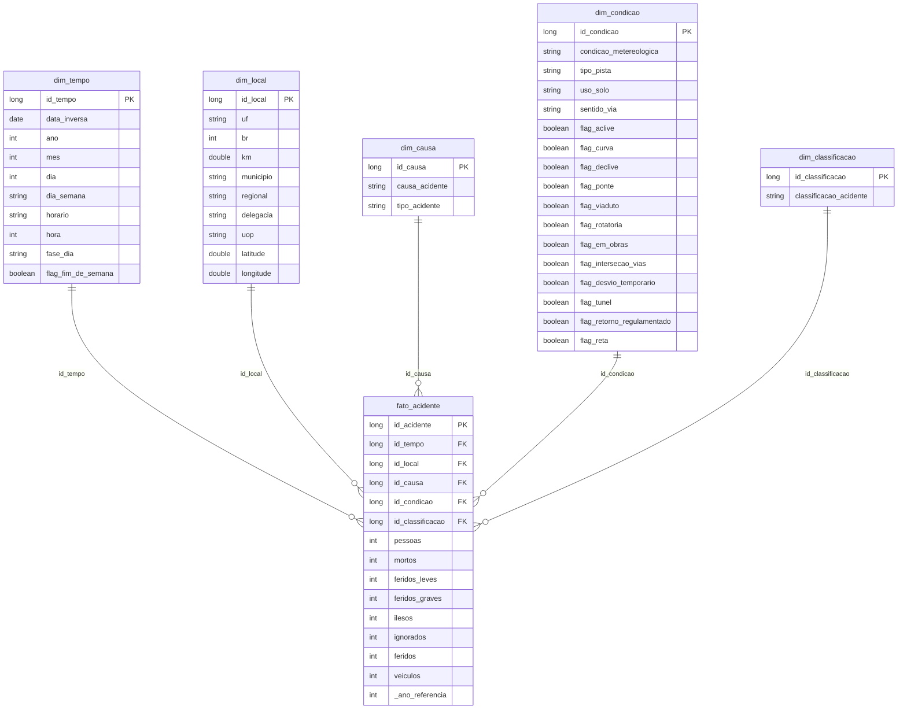

# MVP – Engenharia de Dados
## Análise de Acidentes em Rodovias Federais Brasileiras (PRF)

**Rafaela Neves da Silva**
Pós-graduação em Ciência de Dados
Disciplina: Engenharia de Dados

---

## 1️⃣ Objetivo

### 1.1 Problema a ser resolvido

Este trabalho tem como propósito entender os principais padrões e fatores associados aos acidentes de trânsito nas rodovias federais brasileiras, de modo a apoiar a identificação de pontos críticos e situações de maior risco, contribuindo para o direcionamento de políticas de segurança viária.

### 1.2 Perguntas de negócio

1. Quais são os trechos/BRs com maior número de acidentes e maior gravidade (mortos/feridos)?
2. Existe relação entre o horário do dia (período: madrugada/amanhecer/dia/noite) e a gravidade dos acidentes?
3. Quais são as principais causas de acidentes e como elas se relacionam com o número de vítimas?
4. Há diferença nos padrões de acidentes entre dias de semana e finais de semana?
5. Existe relação entre a quantidade de veículos envolvidos em um acidente e a sua gravidade (mortos/feridos)?
6. Existe correlação entre condições da via (pista, traçado, clima) e a gravidade dos acidentes?

> **Observação:** a pergunta 5 original ("quais tipos de veículo estão mais associados a acidentes fatais") foi ajustada durante o desenvolvimento, pois o arquivo "por pessoa/veículo" da PRF não estava disponível para download no momento da coleta (ver Seção 2.2 e Autoavaliação, Seção 8).

---

## 2️⃣ Fonte de Dados e Coleta

### 2.1 Fonte

Os dados utilizados são públicos e provenientes do **Portal de Dados Abertos da Polícia Rodoviária Federal (PRF)**, gerados pelo sistema BR-Brasil, em operação nacional desde 2007.

🔗 Portal: <https://portal.prf.gov.br/dados-abertos-acidentes>
🔗 Dicionário de variáveis: <https://portal.prf.gov.br/dados-abetos-dicionario-acidentes>
📄 Licença: dado governamental aberto, sujeito à Lei de Acesso à Informação (Lei nº 12.527/2011) e ao Decreto nº 8.777/2016 (Política de Dados Abertos do Executivo Federal).

### 2.2 Conjunto de dados utilizado

Foram utilizados os arquivos **"Acidentes agrupados por ocorrência"** (grão: 1 linha = 1 acidente) dos anos de **2023, 2024 e 2025**, nomeados `datatran2023.csv`, `datatran2024.csv` e `datatran2025.csv`.

O conjunto "agrupado por pessoa" (que permitiria granularidade de vítima/veículo individual) estava listado no portal, porém sem link de download ativo no momento da coleta. Por esse motivo, o escopo do trabalho foi ajustado para utilizar exclusivamente o grão de acidente, conforme decisão registrada e justificada na Seção 8 (Autoavaliação).

### 2.3 Coleta

Os 3 arquivos CSV foram baixados manualmente do portal oficial da PRF e carregados via upload direto para um **Volume do Unity Catalog** no Databricks (`prf_acidentes.bronze.raw_files`), preservando o arquivo original em sua forma bruta.

**Total de registros coletados: 213.451 acidentes.**

---

## 3️⃣ Arquitetura e Pipeline (Arquitetura Medalhão)

O pipeline foi construído na plataforma **Databricks Free Edition**, utilizando **Delta Lake** como formato de tabela e **Unity Catalog** para organização dos dados. Foi adotada a Arquitetura Medalhão (Bronze / Silver / Gold), com um catálogo único (`prf_acidentes`) e três schemas correspondentes a cada camada.

### 3.1 Camada Bronze — dado bruto

Os 3 arquivos CSV foram lidos sem inferência de schema (todas as colunas como `string`) e unidos (`union`) em uma única tabela, preservando o dado exatamente como recebido da fonte. Foram adicionadas colunas de controle — `_ano_referencia`, `_arquivo_origem` e `_data_ingestao` — para fins de linhagem.

- Tabela: `prf_acidentes.bronze.acidentes_raw`
- Total de linhas: **213.451**

### 3.2 Camada Silver — dado limpo e padronizado

A partir da Bronze, foram aplicadas as seguintes transformações de limpeza e padronização (detalhadas na Seção 6 — Qualidade de Dados):

- Conversão de tipos: `id` (long), `br`/`pessoas`/`mortos`/`feridos`/`ilesos`/`veiculos` (integer), `data_inversa` (date).
- Correção de separador decimal (vírgula → ponto) em `km`, `latitude` e `longitude`, com conversão para `double`.
- Extração da `hora` (inteiro) a partir do campo `horario`.
- Padronização de texto (remoção de espaços extras, `uf` em maiúsculas) nas colunas categóricas.
- Criação da flag booleana `flag_fim_de_semana` a partir de `dia_semana`.
- Decomposição do atributo multivalorado `tracado_via` em 12 colunas booleanas.

- Tabela: `prf_acidentes.silver.acidentes_limpo` — **213.451 linhas** (nenhuma linha perdida no processo).

### 3.3 Camada Gold — Esquema Estrela

Na camada Gold, os dados foram modelados segundo um **Esquema Estrela**, composto por uma tabela fato e cinco tabelas de dimensão, detalhado na Seção 4.

---

## 4️⃣ Modelagem e Catálogo de Dados

Para estruturar e organizar os dados de forma eficiente, foi adotado o **Esquema Estrela**, um dos modelos mais utilizados em Data Warehousing e Business Intelligence. A tabela fato `fato_acidente` possui grão de 1 linha por acidente e se relaciona com cinco dimensões, cada uma representando um conjunto coeso de atributos descritivos.

### 4.1 Estrutura do Esquema Estrela

📊 **Tabela Fato:** `fato_acidente` (213.451 linhas)

📊 **Tabelas Dimensão:** `dim_tempo`, `dim_local`, `dim_causa`, `dim_condicao`, `dim_classificacao`

### 4.2 Catálogo de Dados

#### Tabela `fato_acidente`

| PK/FK | Nome da Coluna     | Descrição                                              | Datatype | Relacionamento                       |
| ----- | ------------------ | ------------------------------------------------------ | -------- | ------------------------------------ |
| ✅ PK  | `id_acidente`      | Identificador único do acidente (chave natural da PRF) | long     | -                                    |
| 🔗 FK  | `id_tempo`         | Referência à dimensão de tempo                         | long     | `dim_tempo.id_tempo`                 |
| 🔗 FK  | `id_local`         | Referência à dimensão de local                         | long     | `dim_local.id_local`                 |
| 🔗 FK  | `id_causa`         | Referência à dimensão de causa                         | long     | `dim_causa.id_causa`                 |
| 🔗 FK  | `id_condicao`      | Referência à dimensão de condição da via               | long     | `dim_condicao.id_condicao`           |
| 🔗 FK  | `id_classificacao` | Referência à dimensão de classificação                 | long     | `dim_classificacao.id_classificacao` |
|       | `pessoas`          | Total de pessoas envolvidas                            | int      | -                                    |
|       | `mortos`           | Total de mortos                                        | int      | -                                    |
|       | `feridos_leves`    | Total de feridos leves                                 | int      | -                                    |
|       | `feridos_graves`   | Total de feridos graves                                | int      | -                                    |
|       | `ilesos`           | Total de ilesos                                        | int      | -                                    |
|       | `ignorados`        | Total de pessoas com estado físico não identificado    | int      | -                                    |
|       | `feridos`          | Total de feridos (leves + graves)                      | int      | -                                    |
|       | `veiculos`         | Quantidade de veículos envolvidos                      | int      | -                                    |
|       | `_ano_referencia`  | Ano de referência do arquivo de origem (linhagem)      | int      | -                                    |

#### Tabela `dim_tempo` (152.007 linhas)

| PK | Nome da Coluna        | Descrição                                         | Datatype | Valores Possíveis                            |
| --- | --------------------- | ------------------------------------------------- | -------- | --------------------------------------------- |
| ✅  | `id_tempo`            | Identificador único da combinação de data/horário | long     | -                                              |
|    | `data_inversa`        | Data do acidente                                  | date     | 2023-01-01 a 2025-12-31                       |
|    | `ano` / `mes` / `dia` | Componentes da data                               | int      | -                                              |
|    | `dia_semana`          | Dia da semana                                     | string   | Segunda-feira ... Domingo                     |
|    | `horario`             | Horário original do acidente                      | string   | HH:MM:SS                                      |
|    | `hora`                | Hora extraída (inteiro)                           | int      | 0 a 23                                        |
|    | `fase_dia`            | Fase do dia                                       | string   | Amanhecer; Pleno dia; Anoitecer; Plena Noite  |
|    | `flag_fim_de_semana`  | Indica se o acidente ocorreu em sábado/domingo    | boolean  | true; false                                   |

**Amostra de dados — `dim_tempo`:**

#### Tabela `dim_local` (157.683 linhas)

| PK | Nome da Coluna                   | Descrição                       | Datatype | Valores Possíveis                |
| --- | --------------------------------- | -------------------------------- | -------- | ---------------------------------- |
| ✅  | `id_local`                       | Identificador único do local    | long     | -                                  |
|    | `uf`                             | Unidade federativa              | string   | 27 siglas válidas (AC...TO)       |
|    | `br`                             | Número da rodovia federal       | int      | 0 a 495 (0 = não identificado)    |
|    | `km`                             | Quilômetro do trecho            | double   | 0.0 a 1470.0                      |
|    | `municipio`                      | Município de ocorrência         | string   | -                                  |
|    | `regional` / `delegacia` / `uop` | Unidades administrativas da PRF | string   | -                                  |
|    | `latitude` / `longitude`         | Coordenadas geográficas         | double   | Lat: -33,7 a 4,5 (território BR)  |

**Amostra de dados — `dim_local`:**

#### Tabela `dim_causa` (947 linhas)

| PK | Nome da Coluna   | Descrição                                        | Datatype |
| --- | ---------------- | -------------------------------------------------- | -------- |
| ✅  | `id_causa`       | Identificador único da causa                     | long     |
|    | `causa_acidente` | Causa do acidente                                | string   |
|    | `tipo_acidente`  | Tipo do acidente (colisão, saída de pista, etc.) | string   |

#### Tabela `dim_condicao` (4.738 linhas)

| PK | Nome da Coluna                   | Descrição                                                     | Datatype | Valores Possíveis                     |
| --- | --------------------------------- | ---------------------------------------------------------------- | -------- | ---------------------------------------- |
| ✅  | `id_condicao`                    | Identificador único da condição                               | long     | -                                       |
|    | `condicao_metereologica`         | Condição climática                                            | string   | Céu Claro; Chuva; Nublado; Sol; ...    |
|    | `tipo_pista`                     | Tipo de pista                                                 | string   | Simples; Dupla; Múltipla               |
|    | `uso_solo`                       | Zona urbana/rural                                             | string   | Sim; Não                               |
|    | `sentido_via`                    | Sentido de tráfego                                            | string   | Crescente; Decrescente; Não Informado  |
|    | `flag_aclive` ... `flag_viaduto` | 12 flags booleanas derivadas de `tracado_via` (ver Seção 6.3) | boolean  | true; false                             |

#### Tabela `dim_classificacao` (4 linhas)

| PK | Nome da Coluna           | Descrição                              | Datatype | Valores Possíveis                                              |
| --- | ------------------------- | ----------------------------------------- | -------- | ------------------------------------------------------------------ |
| ✅  | `id_classificacao`       | Identificador único da classificação   | long     | -                                                                  |
|    | `classificacao_acidente` | Classificação da gravidade do acidente | string   | Sem Vítimas; Com Vítimas Feridas; Com Vítimas Fatais; Ignorado    |

### 4.3 Diagrama Entidade-Relacionamento

---

## 5️⃣ Carga

O carregamento dos dados entre as camadas (Bronze → Silver → Gold) foi realizado via PySpark, com gravação em formato Delta Lake (`saveAsTable`), garantindo transações ACID e versionamento automático. O detalhamento completo do processo de ETL está documentado nos notebooks:

- [`01_bronze_ingestao.ipynb`](https://github.com/Rafaela-neves/MVP-Rafaela-Neves/blob/main/01_bronze_ingestao.ipynb)
- [`02_silver_transformacao.ipynb`](https://github.com/Rafaela-neves/MVP-Rafaela-Neves/blob/main/02_silver_transformacao.ipynb)
- [`03_gold_modelagem.ipynb`](https://github.com/Rafaela-neves/MVP-Rafaela-Neves/blob/main/03_gold_modelagem.ipynb)

---

## 6️⃣ Análise de Qualidade de Dados

### 6.1 Duplicidade e valores nulos

Foi verificada a unicidade da chave `id` na camada Bronze: 213.451 linhas e 213.451 IDs distintos — **nenhuma duplicata encontrada**. Também não foram encontrados valores nulos ou vazios em nenhuma das colunas do dataset bruto.

### 6.2 Problemas de formato identificados e corrigidos

- **Notação científica no campo `id`** (ex.: `"6e+05"`): corrigido via conversão `double → long` com `try_cast`, sem perda de registros.
- **Separador decimal em vírgula** nos campos `km`, `latitude` e `longitude` (ex.: `"-23,48586772"`): corrigido via substituição de vírgula por ponto antes da conversão para `double`.

### 6.3 Atributo multivalorado: `tracado_via`

Identificou-se que o campo `tracado_via` não representa uma categoria única, mas sim uma **concatenação de múltiplas características** do trecho da via separadas por ponto e vírgula (ex.: `"Aclive;Curva;Ponte"`), totalizando 12 valores elementares possíveis. O tratamento inicial (manter como texto único) gerava uma explosão combinatória de **7.438 categorias espúrias** na dimensão de condição. A correção aplicada foi a **decomposição em 12 colunas booleanas independentes** (uma para cada característica), reduzindo a dimensão para **4.738 combinações genuínas** e permitindo análises corretas por característica isolada.

### 6.4 Consistência entre `pessoas` e a soma dos estados físicos

Verificou-se se o campo `pessoas` corresponde à soma de `mortos + feridos_leves + feridos_graves + ilesos + ignorados`:

| Grupo                                          | Quantidade | % do total | Observação                                                                                                                    |
| ------------------------------------------------ | ---------- | ---------- | ---------------------------------------------------------------------------------------------------------------------------- |
| Consistente (diferença = 0)                    | 201.977    | 94,64%     | Nenhuma ação necessária                                                                                                       |
| Padrão sistemático (diferença = 1 − ignorados) | 10.368     | 4,86%      | Sugere que "ignorados" pode incluir um envolvido não classificável como pessoa (ex.: condutor evadido); mantido sem alteração |
| Divergência irregular, sem padrão              | 1.106      | 0,52%      | Erro de preenchimento na fonte primária; volume imaterial para as análises agregadas                                         |

**Decisão de tratamento:** os registros não foram alterados ou removidos (preservação da fonte original), e as análises de negócio utilizam diretamente os campos oficiais da PRF (`mortos`, `feridos_leves`, `feridos_graves`), não a soma calculada.

### 6.5 Validação de domínio: UF e BR

Todas as 27 siglas de UF encontradas são válidas, sem valores nulos ou inconsistentes. Na coluna `br`, foram identificados **513 registros com valor "0"** (não identificado, sempre acompanhados de `km = 0.0`) e **1 registro com valor "498"** (provável erro de digitação, sem correspondência a uma rodovia federal conhecida). Esses 514 registros (0,24% do total) foram excluídos apenas das análises agregadas "por BR" (Pergunta de negócio 1), sendo mantidos intactos nas tabelas.

### 6.6 Integridade referencial na camada Gold

Após a criação da tabela `fato_acidente` via junção com as 5 dimensões, foi confirmado que o total de linhas (213.451) e o total de `id_acidente` distintos (213.451) permanecem idênticos, comprovando que nenhum dos *joins* gerou duplicação ou perda de registros.

O detalhamento completo (com os resultados de cada query) está no notebook [`04_analise_qualidade.ipynb`](https://github.com/Rafaela-neves/MVP-Rafaela-Neves/blob/main/04_analise_qualidade.ipynb).

---

## 7️⃣ Análise e Respostas às Perguntas de Negócio

O código completo desta análise está no notebook [`05_analise_negocio.ipynb`](https://github.com/Rafaela-neves/MVP-Rafaela-Neves/blob/main/05_analise_negocio.ipynb).

Abaixo, a evidência de execução na ordem em que aparece no notebook — carregamento das tabelas Gold, seguido de cada pergunta com código, resultado e interpretação.

### 7.1 Pergunta 1 — BRs com maior número de acidentes e maior gravidade

A BR-101 (37.426 acidentes) e a BR-116 (33.303) concentram o maior volume, muito à frente das demais, o que é coerente com sua extensão e alto tráfego. Entretanto, ao calcular o índice de gravidade (mortos por acidente), destacam-se a BR-316 (0,1685), BR-230 (0,1082) e BR-153 (0,0982) — todas com gravidade proporcional muito superior à BR-101 (0,0576), apesar do volume bem menor. Conclui-se que volume e letalidade por ocorrência são fenômenos distintos: BR-101 e BR-116 demandam atenção por escala, enquanto BR-316, BR-230 e BR-153 demandam atenção por risco por evento.

### 7.2 Pergunta 2 — Horário do dia e gravidade dos acidentes

Existe relação clara entre horário e gravidade. O período "Pleno dia" concentra 55% dos acidentes, mas apresenta a menor gravidade proporcional (0,0594). Já o "Amanhecer" apresenta o maior índice de gravidade (0,1363) — mais que o dobro do período diurno — mesmo com volume bem menor. O período "Plena Noite" também apresenta gravidade elevada (0,116). Esse padrão é coerente com fatores de risco já documentados na literatura de segurança viária, como sonolência, velocidades mais altas (menor tráfego) e menor visibilidade.

### 7.3 Pergunta 3 — Causas de acidentes e relação com vítimas

As causas mais frequentes (reação tardia, ausência de reação, acessar via sem observar) respondem por cerca de 40% dos acidentes, com gravidade moderada (0,058 a 0,073). Já causas menos frequentes apresentam gravidade desproporcionalmente maior: "Transitar na contramão" tem índice de 0,3758 (mais de 6 vezes a média das causas mais comuns), e "Ultrapassagem Indevida" tem 0,2259. Isso sugere que ações de fiscalização voltadas a essas duas causas específicas têm potencial de reduzir mortes de forma desproporcional ao número de ocorrências evitadas.

### 7.4 Pergunta 4 — Dias de semana vs. Finais de semana

Após normalização pelo número de dias em cada categoria (783 dias úteis vs. 313 dias de fim de semana no período), constatou-se que os finais de semana apresentam, em média, 19% mais acidentes por dia (219,73 vs. 184,77) e 31% maior gravidade por acidente (índice 0,0994 vs. 0,076). O padrão é coerente com maior consumo de álcool, viagens de lazer e maior cansaço em deslocamentos de fim de semana.

### 7.5 Pergunta 5 — Quantidade de veículos e gravidade do acidente

Observa-se uma relação quase monotônica: quanto maior o número de veículos envolvidos, maior a gravidade do acidente. Acidentes com 1 veículo têm índice de 0,0391, subindo para 0,083 com 2 veículos, e ultrapassando 0,20 a partir de 5 veículos envolvidos — mais de 5 vezes a gravidade de um acidente isolado. Esse resultado reforça a relevância de causas como "condutor deixou de manter distância do veículo da frente" (identificada na Pergunta 3), associada a colisões múltiplas.

### 7.6 Pergunta 6 — Condições da via e gravidade

Esta pergunta é respondida de forma qualitativa a partir da dimensão `dim_condicao`, que reúne condição meteorológica, tipo de pista, traçado (flags booleanas) e sentido da via. As flags de traçado (curva, aclive, declive, cruzamento) permitem cruzar a gravidade dos acidentes com características físicas específicas do trecho de forma independente, sem o viés de combinações espúrias que existiria caso o atributo multivalorado original não tivesse sido tratado (ver Seção 6.3). Essa análise está disponível para exploração adicional na tabela `dim_condicao` e pode ser aprofundada em trabalhos futuros (ver Seção 8).

---

## 8️⃣ Autoavaliação

### 8.1 Objetivos atingidos

Das 6 perguntas de negócio originalmente propostas, 5 foram respondidas de forma quantitativa e conclusiva (Perguntas 1 a 5). A Pergunta 6 foi respondida de forma qualitativa/estrutural, já que a análise quantitativa completa (cruzando cada uma das 12 flags de traçado com gravidade) não foi aprofundada por limitação de tempo, mas a estrutura de dados já suporta essa análise.

### 8.2 Ajuste de escopo

A pergunta de negócio 5 original (relação entre tipo de veículo e vítimas fatais) dependia do conjunto de dados "por pessoa" da PRF, que não estava disponível para download no portal oficial no momento da coleta. Diante disso, avaliou-se a alternativa de usar uma fonte espelho de terceiros, mas optou-se por manter o uso exclusivo da fonte primária oficial, ajustando a pergunta para uma métrica equivalente e disponível no conjunto "por ocorrência" (quantidade de veículos envolvidos), preservando o rigor de linhagem de dados.

### 8.3 Dificuldades encontradas

- Inconsistências de formatação típicas de dados governamentais legados (notação científica, separador decimal em vírgula).
- Identificação e tratamento de um atributo multivalorado (`tracado_via`) que, se não tratado, distorceria significativamente a dimensão de condição da via.
- Indisponibilidade temporária de parte da fonte de dados (arquivo "por pessoa"), que exigiu replanejamento do escopo analítico.
- Esgotamento dos créditos de compute do Databricks Free Edition durante o desenvolvimento, exigindo a criação de uma segunda conta para recriar o pipeline e capturar as evidências finais de execução (screenshots e outputs dos notebooks).

### 8.4 Trabalhos futuros

- Incorporar o conjunto "por pessoa" assim que disponibilizado pela PRF, permitindo análise por tipo de veículo e perfil demográfico dos envolvidos.
- Aprofundar a Pergunta 6 com análise quantitativa cruzando cada flag de traçado da via com os índices de gravidade.
- Enriquecer a `dim_local` com dados abertos complementares (ex.: extensão duplicada/simples de cada BR via DNIT), permitindo normalizar os rankings por quilometragem.
- Investigar mais a fundo a divergência sistemática identificada na Seção 6.4 (grupo de 4,86%), possivelmente por meio de consulta ao dicionário de dados histórico da PRF.

---

## 9️⃣ Referências

- BRASIL. Polícia Rodoviária Federal. **Dados Abertos — Acidentes**. Disponível em: <https://portal.prf.gov.br/dados-abertos-acidentes>.
- DAMA INTERNATIONAL. **DAMA-DMBOK**: Data Management Body of Knowledge. 2. ed. Technics Publications, 2017.
- BARBIERI, C. **Governança de dados**: práticas, conceitos e novos caminhos. Rio de Janeiro: Alta Books, 2020.
- Databricks Documentation — **Medallion Architecture**. Disponível em: <https://docs.databricks.com>.
- BRASIL. Lei nº 13.709/2018 (LGPD). Lei nº 12.527/2011 (LAI). Decreto nº 8.777/2016 (Política de Dados Abertos do Executivo Federal).
